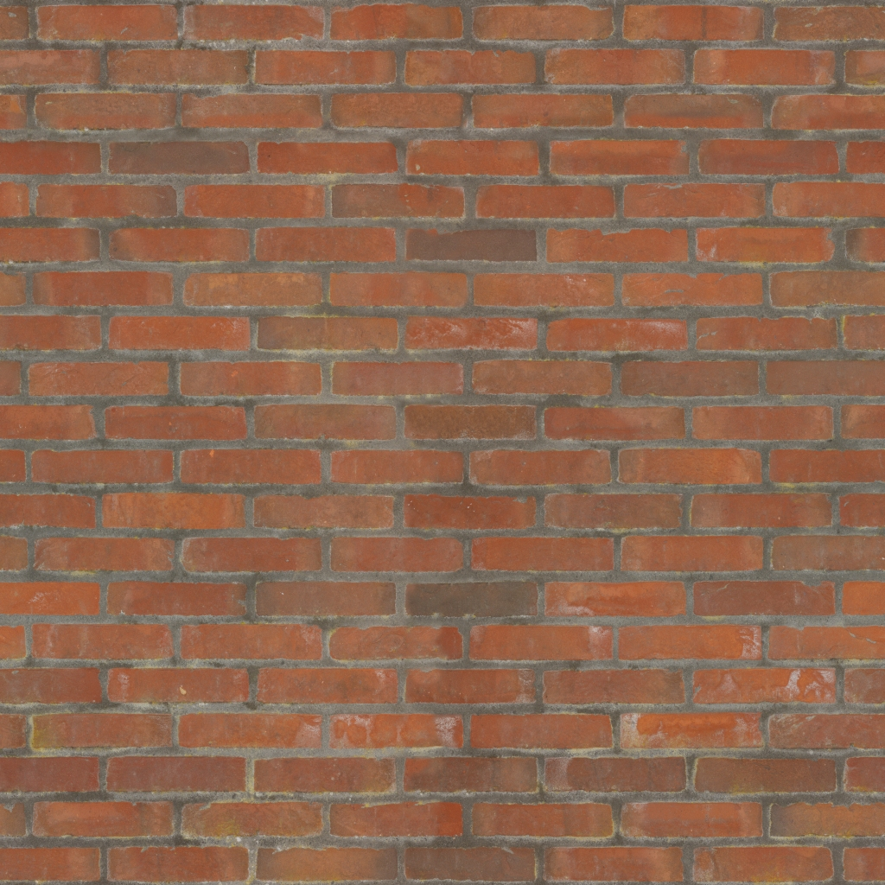
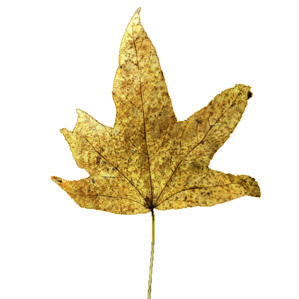

#+TITLE: README
#+AUTHOR: Joana & NÍcolas
#+DATE: \date

Usamos [[file:docs/[how-to] como adicionar novos assets (modelos, texturas) ao jogo.org][como adicionar novos assets (modelos, texturas) ao jogo]] para guiar a implementação de novos /assets/ (modelos, texturas) ao jogo.
Leia [[file:docs/[how-to] objetivo do jogo e como jogar.org][objetivo do jogo e como jogar]] para conhecer os controles do teclado e o objetivo geral do jogo.
Havendo dificuldades para compilar o jogo, confira [[file:docs/[internal] compilando.org][o script de compilação]].

* Tecnologias
- C++17
- OpenGL 3.3 Core Profile
- GLFW, GLAD, GLM
- tinyobjloader, stb_image
- Miniaudio (áudio)

* Compilação e execução
Consulte o arquivo [[file:COMPILACAO.md][COMPILACAO.md]] para instruções detalhadas. Em resumo:
#+BEGIN_SRC bash
cmake --preset default
cmake --build build
./bin/Linux/main
#+END_SRC

* Estrutura de arquivos
** assets/: Recursos (áudio, modelos, shaders, texturas)

*** /audio/
- [[file:assets/audio/cartoon-boing-bouncy-big_F_major.wav][cartoon-boing-bouncy-big_F_major.wav]]: Som de pulo/captura
- [[file:assets/audio/cartoonish-stone-sfx-slow.wav][cartoonish-stone-sfx-slow.wav]]: Som de colisão com rocha
- [[file:assets/audio/crushing-leafs-cinematic-fx_E_minor.wav][crushing-leafs-cinematic-fx_E_minor.wav]]: Som de colisão com árvore
- [[file:assets/audio/drum-roll-and-bell_112bpm.wav][drum-roll-and-bell_112bpm.wav]]: Som ao passar por um anel

*** /models/
- [[file:assets/models/bird/0V3HJRW3DQ5QPF3J2O5PR4Z1M.obj][0V3HJRW3DQ5QPF3J2O5PR4Z1M.obj]]: Modelo do pássaro voando
- [[file:assets/models/bird_standing/G1FXKUZIFSQHX0QERXO6AAO63.obj][G1FXKUZIFSQHX0QERXO6AAO63.obj]]: Modelo do pássaro em pé
- [[file:assets/models/the_letter.obj][the_letter.obj]]: Modelo da carta
- [[file:assets/models/trees/GenTree-103_AE3D_03122023-F1.obj][GenTree-103_AE3D_03122023-F1.obj]]: Modelo da árvore
- [[file:assets/models/plane.obj][plane.obj]]: Malha de referência (não usada diretamente)
- [[file:assets/models/house.obj][house.obj]]: Modelo de casa (não usado *atualmente*: usamos [[file:engine/src/Objects/Drawables/HouseDrawable.cpp][HouseDrawable]] procedural)

*** /shaders/
- [[file:assets/shaders/shader_vertex.glsl][shader_vertex.glsl]]: Vertex shader principal (transformações, iluminação básica)
- [[file:assets/shaders/shader_fragment.glsl][shader_fragment.glsl]]: Fragment shader (texturas, cores, object_id)

*** /textures/
- : Textura de tijolo (para construções)
- [[file:assets/textures/rocky_terrain_02_diff_1k.jpg][rocky_terrain_02_diff_1k.jpg]]: Textura de terreno rochoso
- : Folha da árvore (canal alpha)
- [[file:assets/textures/tree1_textures/Tree_1_Trunk_Limbs-DIFFUSE.png][Tree_1_Trunk_Limbs-DIFFUSE.png]]: Difusa do tronco
- [[file:assets/textures/tree1_textures/Tree_1_Twigs-DIFFUSE.jpg][Tree_1_Twigs-DIFFUSE.jpg]]: Difusa dos galhos

** =engine/=: Código fonte
*** =include/=: Arquivos de cabeçalho
**** =audio/=
- [[file:engine/include/audio/AudioManager.hpp][AudioManager.hpp]]: Gerenciador de sons (baseado em miniaudio)

**** =Collision/=
- [[file:engine/include/Collision/Collider.hpp][Collider.hpp]]: Classe base para colisores
- [[file:engine/include/Collision/CapsuleCollider.hpp][CapsuleCollider.hpp]]: Colisor cápsula (usado pelo pássaro)
- [[file:engine/include/Collision/SphereCollider.hpp][SphereCollider.hpp]]: Colisor esférico
- [[file:engine/include/Collision/AABBCollider.hpp][AABBCollider.hpp]]: Colisor caixa alinhada aos eixos
- [[file:engine/include/Collision/CylindricalCollider.hpp][CylindricalCollider.hpp]]: Colisor cilíndrico
- [[file:engine/include/Collision/CollisionSystem.hpp][CollisionSystem.hpp]]: Sistema de detecção de colisões

**** =Game/=
- [[file:engine/include/Game/Application.hpp][Application.hpp]]: Classe de alto nível (loop principal, janela)
- [[file:engine/include/Game/Bird.hpp][Bird.hpp]]: Pássaro controlável (física, colisão, estados)
- [[file:engine/include/Game/Camera.hpp][Camera.hpp]]: Câmera em terceira pessoa
- [[file:engine/include/Game/Renderer.hpp][Renderer.hpp]]: Central de desenho (shaders, objetos)
- [[file:engine/include/Game/Scene.hpp][Scene.hpp]]: Gerencia objetos do mundo, colisões, lógica
- [[file:engine/include/Game/Window.hpp][Window.hpp]]: Encapsulamento da janela GLFW

**** =Loaders/=
- [[file:engine/include/Loaders/ObjLoader.hpp][ObjLoader.hpp]]: Carregamento de modelos OBJ (tinyobjloader)
- [[file:engine/include/Loaders/TextureLoader.hpp][TextureLoader.hpp]]: Carregamento de texturas (stb_image)

**** =Objects/=
- [[file:engine/include/Objects/Assets.hpp][Assets.hpp]]: Definição de modelos e texturas carregados
- [[file:engine/include/Objects/Building.hpp][Building.hpp]]: Edifício retangular (colidível)
- [[file:engine/include/Objects/House.hpp][House.hpp]]: Casa como GameObject (usa HouseDrawable)
- [[file:engine/include/Objects/Letter.hpp][Letter.hpp]]: Carta (GameObject com estados)
- [[file:engine/include/Objects/ObjDrawable.hpp][ObjDrawable.hpp]]: Drawable para modelos OBJ
- [[file:engine/include/Objects/ProceduralRock.hpp][ProceduralRock.hpp]]: Rocha procedural (GameObject)
- [[file:engine/include/Objects/Ring.hpp][Ring.hpp]]: Anel coletável (GameObject)
- [[file:engine/include/Objects/StaticObject.hpp][StaticObject.hpp]]: Objeto estático (árvores)
***** =Objects/Drawables/=
  - [[file:engine/include/Objects/Drawables/HouseDrawable.hpp][HouseDrawable.hpp]]: Drawable da casa procedural
  - [[file:engine/include/Objects/Drawables/RingDrawable.hpp][RingDrawable.hpp]]: Drawable do anel (billboard)
  - [[file:engine/include/Objects/Drawables/RockDrawable.hpp][RockDrawable.hpp]]: Drawable da rocha (esfera deformada)
  - [[file:engine/include/Objects/Drawables/LetterDrawable.hpp][LetterDrawable.hpp]]: Drawable da carta (não implementado, usa ObjDrawable)

***** =Objects/Interfaces/=
- [[file:engine/include/Objects/Interfaces/Collidable.hpp][Collidable.hpp]]: Interface para objetos que colidem
- [[file:engine/include/Objects/Interfaces/Drawable.hpp][Drawable.hpp]]: Interface para objetos renderizáveis (Buffers, Vertex)
- [[file:engine/include/Objects/Interfaces/GameObject.hpp][GameObject.hpp]]: Classe base para entidades do jogo

**** =Renderer/=
- [[file:engine/include/Renderer/ShaderLoader.hpp][ShaderLoader.hpp]]: Carregamento e compilação de shaders GLSL

**** =Terrain/=
- [[file:engine/include/Terrain/Terrain.hpp][Terrain.hpp]]: Terreno procedural (malha, água, ruído)
- [[file:engine/include/Terrain/Skybox.hpp][Skybox.hpp]]: Céu procedural (shader interno)

**** =Window/=
- [[file:engine/include/Window/InputCallbacks.hpp][InputCallbacks.hpp]]: Variáveis e funções de callback de teclado/mouse
- [[file:engine/include/Window/WindowCallbacks.hpp][WindowCallbacks.hpp]]: Callbacks de janela (redimensionamento, erro)

**** Outros headers de suporte
- [[file:engine/include/matrices.h][matrices.h]]: Funções auxiliares para matrizes (lookAt, perspectiva, etc.)
- [[file:engine/include/textrendering.hpp][textrendering.hpp]]: Renderização de texto na tela (debug)
- [[file:engine/include/utils.h][utils.h]]: Macros e utilidades diversas
- [[file:engine/include/dejavufont.h][dejavufont.h]]: Fonte embutida para texto
- [[file:engine/include/tiny_obj_loader.h][tiny_obj_loader.h]]: Biblioteca OBJ (single header)
- [[file:engine/include/stb_image.h][stb_image.h]]: Biblioteca de carregamento de imagens
- [[file:engine/include/glad/glad.h][glad/glad.h]]: Loader de funções OpenGL
- [[file:engine/include/GLFW/glfw3.h][GLFW/glfw3.h]]: Biblioteca de janelas
- [[file:engine/include/glm/glm.hpp][glm/glm.hpp]]: Matemática vetorial/matricial

*** =src/=: Implementações
- [[file:engine/src/main.cpp][main.cpp]]: Ponto de entrada do programa (chama Application)

**** =audio/=
- [[file:engine/src/audio/AudioManager.cpp][AudioManager.cpp]]: Implementação do gerenciador de áudio
- [[file:engine/src/audio/miniaudio.c][miniaudio.c]]: Biblioteca de áudio (compilada)

**** =Collision/=
- [[file:engine/src/Collision/CollisionSystem.cpp][CollisionSystem.cpp]]: Algoritmos de colisão (não usados extensivamente)

**** =Game/=
- [[file:engine/src/Game/Application.cpp][Application.cpp]]: Inicialização, loop principal, dia/noite
- [[file:engine/src/Game/Bird.cpp][Bird.cpp]]: Controle do pássaro (teclado, física, colisor)
- [[file:engine/src/Game/Camera.cpp][Camera.cpp]]: Posicionamento da câmera atrás do pássaro
- [[file:engine/src/Game/Renderer.cpp][Renderer.cpp]]: Desenho de cada tipo de objeto (bird, terreno, anéis…)
- [[file:engine/src/Game/Scene.cpp][Scene.cpp]]: Construção da cena, atualização, colisões
- [[file:engine/src/Game/Window.cpp][Window.cpp]]: Criação da janela, callbacks

**** =Loaders/=
- [[file:engine/src/Loaders/ObjLoader.cpp][ObjLoader.cpp]]: Carregamento de OBJ e construção da cena virtual
- [[file:engine/src/Loaders/TextureLoader.cpp][TextureLoader.cpp]]: Carregamento de texturas via stb_image

**** =Objects/=
- [[file:engine/src/Objects/Assets.cpp][Assets.cpp]]: Carrega texturas e define modelos
- [[file:engine/src/Objects/Building.cpp][Building.cpp]]: Geração de caixa texturizada
- [[file:engine/src/Objects/Letter.cpp][Letter.cpp]]: Carta (estados, transformações)
- [[file:engine/src/Objects/ObjDrawable.cpp][ObjDrawable.cpp]]: Drawable que renderiza objetos da cena virtual
- [[file:engine/src/Objects/ProceduralRock.cpp][ProceduralRock.cpp]]: Rocha procedural (GameObject)
- [[file:engine/src/Objects/Ring.cpp][Ring.cpp]]: Anel (colisão, animação)
- [[file:engine/src/Objects/StaticObject.cpp][StaticObject.cpp]]: Objeto estático (árvores)

***** =Objects/Drawables/=
- [[file:engine/src/Objects/Drawables/HouseDrawable.cpp][HouseDrawable.cpp]]: Geração da malha da casa (cores sólidas)
- [[file:engine/src/Objects/Drawables/RingDrawable.cpp][RingDrawable.cpp]]: Geração do anel (dois círculos) e efeito billboard
- [[file:engine/src/Objects/Drawables/RockDrawable.cpp][RockDrawable.cpp]]: Geração de esfera com ruído e normais

**** =Renderer/=
- [[file:engine/src/Renderer/ShaderLoader.cpp][ShaderLoader.cpp]]: Carrega e compila shaders dos arquivos GLSL

**** =Terrain/=
- [[file:engine/src/Terrain/Terrain.cpp][Terrain.cpp]]: Implementação completa do terreno (montanhas, lago, ilhas, cores)
- [[file:engine/src/Terrain/Skybox.cpp][Skybox.cpp]]: Céu procedural (shader embutido, cubo)

**** =Window/=
- [[file:engine/src/Window/InputCallbacks.cpp][InputCallbacks.cpp]]: Callbacks de teclado/mouse (debug, projeção, ângulos)
- [[file:engine/src/Window/WindowCallbacks.cpp][WindowCallbacks.cpp]]: Callbacks de redimensionamento e erro

**** Outros =.cpp=
- [[file:engine/src/buildtriangles.cpp][buildtriangles.cpp]]: Função auxiliar (provavelmente obsoleta)
- [[file:engine/src/correcao.cpp][correcao.cpp]]: Callback para correção automática (laboratório)
- [[file:engine/src/dejavufont.cpp][dejavufont.cpp]]: Dados da fonte embutida
- [[file:engine/src/textrendering.cpp][textrendering.cpp]]: Renderização de texto (usando a fonte)

** =docs/=: Documentação interna
- [[file:docs/compilando.org][compilando.org]]: Guia de compilação
- [[file:docs/aplicação principal.org][aplicação principal.org]]: Sobre Application, Window, Renderer
- [[file:docs/assets, texturas, modelos e objetos.org][assets, texturas, modelos e objetos.org]]: Detalhes de Assets, ObjLoader
- [[file:docs/callbacks para window e input.org][callbacks para window e input.org]]: Explicação dos callbacks
- [[file:docs/carregadores.org][carregadores.org]]: Loaders de OBJ e textura
- [[file:docs/main.org][main.org]]: Descrição do ponto de entrada
- [[file:docs/terreno, relevo e céu.org][terreno, relevo e céu.org]]: Geração procedural do terreno e skybox
- Os demais arquivos em `docs/antigas/` e `docs/estudos/` são rascunhos e podem ser ignorados.

** =external/=: Bibliotecas externas compiladas junto
- [[file:external/glad.c][glad.c]]: Gerador de funções OpenGL
- [[file:external/stb_image.cpp][stb_image.cpp]]: Implementação stb_image
- [[file:external/tiny_obj_loader.cpp][tiny_obj_loader.cpp]]: Implementação tinyobjloader
