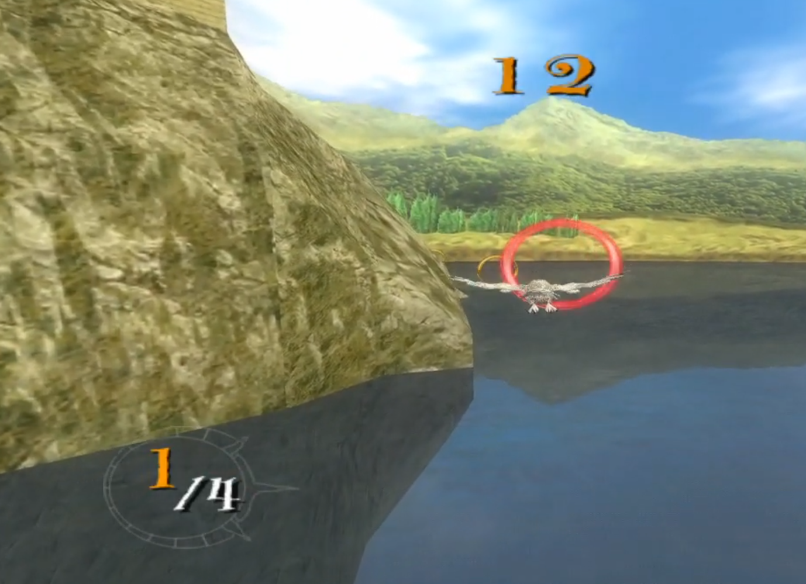
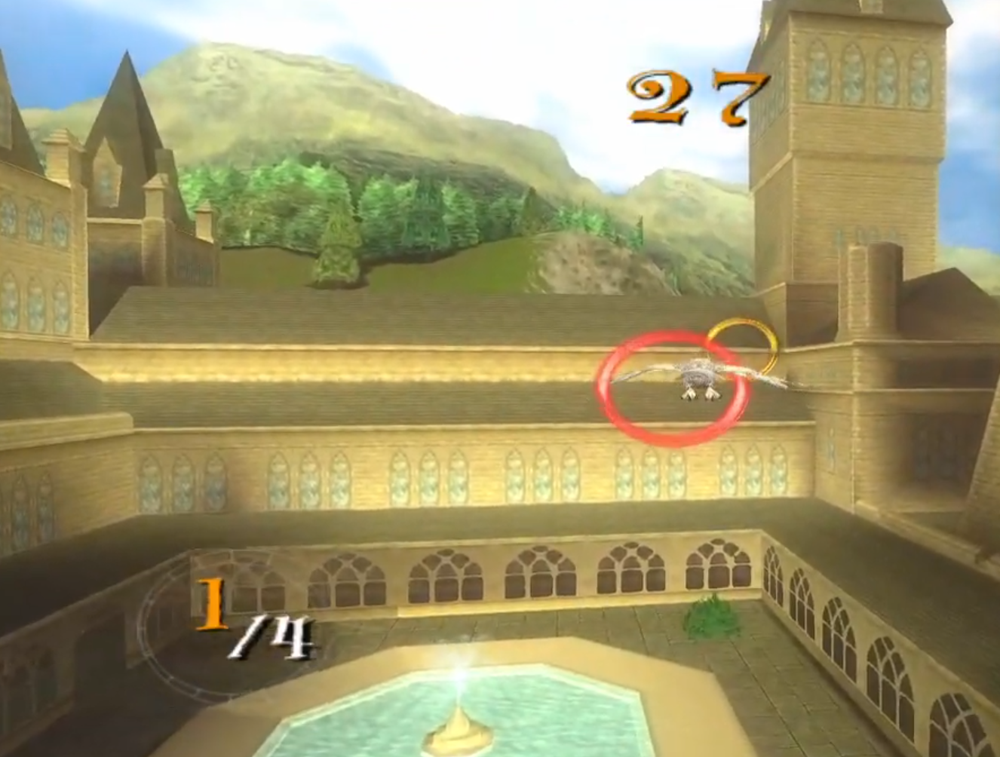
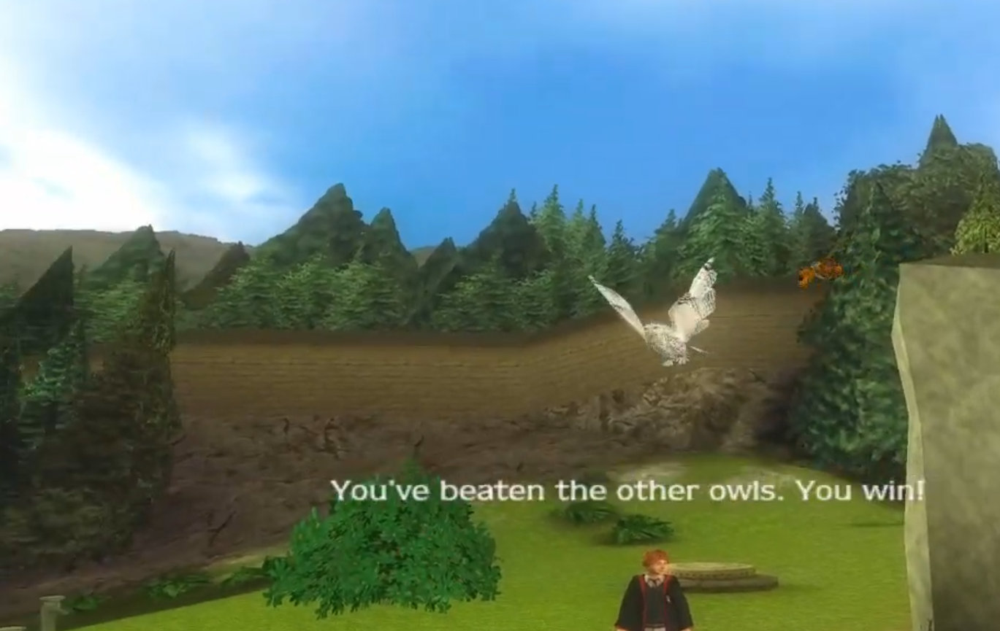
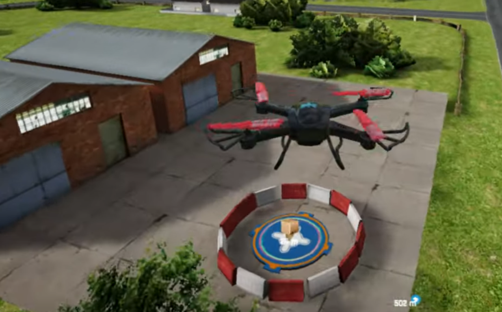

# Especificação da Implementação

> [!CAUTION]
> - Você <ins>**não pode utilizar ferramentas de IA para escrever esta
>   especificação**</ins>

## Integrantes da dupla

- **Aluno 1 - Nome**: Nícolas Rosenthal Dal Corso
- **Aluno 1 - Cartão UFRGS**: 00304709

- **Aluno 2 - Nome**: Joana Oliveira DAvila
- **Aluno 2 - Cartão UFRGS**: 00274739

## Detalhes do que será implementado

- **Título do trabalho**: _Carrier Birds Simulator_ (nome temporário)
- **Parágrafo curto descrevendo o que será implementado**:
Será implementado um simulador no qual aves transportam objetos de um ponto inicial até um destino definido, desviando de obstáculos, como árvores, paredes e estruturas sólidas, e atravessando ambientes com superfícies flexiveis como folhagem, rios, lago, nuvens. O usuário poderá controlar o voo da ave e o momento de entrega do objeto.
Serão implementadas colisões entre o jogador e outras aves, bem como em relação ao ambiente.

## Especificação visual
### Vídeo - Link

> [!IMPORTANT]
> - Coloque aqui um link para um vídeo que mostre a aplicação gráfica
>   de referência que você vai implementar. **Sua implementação deverá
>   ser o mais parecido possível com o que é mostrado no vídeo (mais
>   detalhes abaixo).**
> - **Você não pode escolher como referência: (1) algum trabalho realizado
>   por outros alunos desta disciplina, em semestres anteriores. (2) Minecraft.**
> - Por exemplo, você pode colocar um vídeo de um jogo que você gosta,
>   e seu trabalho final será uma re-implementação do jogo.
> - O vídeo pode ser um link para YouTube, Google Drive, ou arquivo mp4 dentro
>   do próprio repositório. Mas, garanta que qualquer um tenha
>   permissão de acesso ao vídeo através deste link.

1. [Flying Bird Simulator](https://www.youtube.com/watch?v=zi2BpBqko0E)
2. [Drone Delivery Simulator](https://youtu.be/QvNqsuou13Y?si=Y6hbDeq5WjAfH7RY)
3. [Harry Potter and the Prisioner of Azkaban (PS2) Owl Racing minigame](https://www.youtube.com/watch?v=WKa6vVh3TXg)

### Vídeo - Timestamp
[Harry Potter and the Prisioner of Azkaban (PS2) Owl Racing minigame](https://www.youtube.com/watch?v=WKa6vVh3TXg)
- **Timestamp inicial**: `00:03`
- **Timestamp final**: `00:33`

### Imagens
Coruja voando sobre água e rochas.

Coruja sobrevoando edifícios do castelo.

Coruja atingindo seu objetivo, destacando câmera distinta da anterior.

`Drone Delivery Simulator`: semelhante ao que desejamos implementar. Abaixo, o drone está indo recolher sua carga (uma caixa). Nossa intenção é que a coruja seja capaz de captar e entregar uma carta. A carta é extraída de uma localidade e _deixada cair_, em rota parabólica, até seu local objetivo.

## Especificação textual
Para cada um dos requisitos abaixo (detalhados no [Enunciado do Trabalho final - Moodle](https://moodle.ufrgs.br/mod/assign/view.php?id=6018620)), escreva um parágrafo **curto** explicando como este requisito será atendido, apontando itens específicos do vídeo/imagens que você incluiu acima que atendem estes requisitos.

### Malhas poligonais complexas
Aves e objetos de entrega e cenário, como árvores, pedras e outros obstáculos, serão representados por malhas de polígonos.

### Transformações geométricas controladas pelo usuário
Como o usuário irá controlar uma ave, as transformações serão aplicadas nela, para o controle por teclado e mouse, permitindo controlar a dinâmica do voo.

### Diferentes tipos de câmeras
Ao menos duas cameras, terceira pessoa, atrás da ave, e primeira pessoa, visão da ave. O usuario poderá alternar entre elas.

### Instâncias de objetos
Elementos de obstaculos, arvores, nuvens, prédios simples baseados no castelo visto no vídeo, serão instanciados multiplas vezes no cenario.

### Testes de intersecção
Haverá teste de colisão entre ave e obstaculos, e pacote e solo. Aves não podem ultrapassar arvores, mas poderia ultrapassar agua e folhas esparsas. Pacote caso esteja numa altura indesejada pode sofrer dano se soltado longe do chão.

### Modelos de Iluminação em todos os objetos
O modelo de iluminação deve permitir que haja sombra da ave no solo, assim como de nuvens. Sombras devem ser mais detalhadas quanto mais longe da luz.

### Mapeamento de texturas em todos os objetos
Todos os objetos pensados tem texturas, terrenos, árvores, ave, água.

### Movimentação com curva Bézier cúbica
Alguns movimentos da ave pode ser automatizado para a aplicação das curvas. No entanto, se um dos objetos for leve suficiente como carta, deve haver um deslizamento suave.

### Animações baseadas no tempo ($\Delta t$)
A movimentação da ave, enquanto voa é baseada no tempo, removendo a necessidade de pressionar algum botão para a ave se manter voando.

## Limitações esperadas

> [!IMPORTANT]
> - Coloque aqui uma lista de detalhes visuais ou de interação que
>   aparecem no vídeo e/ou imagens acima, mas que você **não pretende
>   implementar** ou que você **irá implementar parcialmente**.
> - Para cada item, **explique por que** não será implementado ou por
>   que será implementado parcialmente.

- **Física de voo** não iremos implementar toda a aerodinâmica de voar, mas quanto mais perto melhor
- **Animação das asas** o ideal seria simular a ação do vento nas penas e ajustes naturais enquanto a ave voa, mas isso exigiria maior complexidade
- **Aplicação de dano** quando objeto cair de uma altura maior do que o esperado será aplicado uma deformação simbolica.
