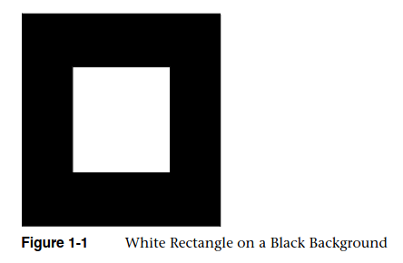
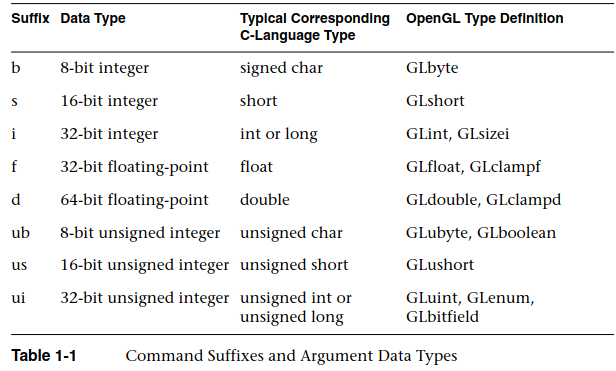

:PROPERTIES:
:ID:       ce74f5e1-be50-4e6f-9183-a23b27f84e0f
:aliases:  [OpenGL-guide-chap-1] Introduction to OpenGL
:projeto:  computer-graphics-visualization
:zid:      202604200952
:END:
#+title: [OpenGL-guide-chap-1] Introdução à OpenGL
#+filetags: :computer-graphics-visualization:draft:

Este documento reúne anotações sobre o capítulo 1 (/Introduction to OpenGL/) de [[id:429fbec4-c22b-4f99-b5b6-d821cec48854][OpenGL Programming Guide, /Shreiner/, Dave. 7ª ed. (The Khronos OpenGL ARB Working Group). Ed. (2010)]].

* O que é /OpenGL/?
  *OpenGL* é uma interface de software para /hardware/ gráfico. Esta interface é composta por mais de 700 comandos que são usados para *especificar /objetos e operações/ necessárias para produzir aplicações tridimensionais interativas*. OpenGL *não* fornece operações para definir /janelas/ ou para /obter input do usuário/; isto é assim feito para que o programador use o sistema operacional especificado para tais operações. O objetivo do Op enGL é *fornecer um pequeno conjunto de /primitivas geométricas/ através das quais é possível desenvolver modelos e aplicações complexas*.

  Os /geometric primitives/ do OpenGL são *points*, *lines* e *polygons*.

  Existem *bibliotecas construídas /sobre/ o OpenGL* e que fornecem /features/ de mais alto nível. Este é o caso da *GLU* (/OpenGL Utility Library/) para /features/ de modelagem (como /superfícies quadráticas/ e /NURBS curves and surfaces/). *GLU é parte padrão de toda implementação do OpenGL*.

** Alguns Conceitos Iniciais
- *renderizar* ("/Rendering/","/to render [something]/"): renderização é o processo através do qual o computador *cria imagens a partir de modelos*.
- *modelos* ou *objetos*, em OpenGL, são construídos a partir de *primitivas geométricas* (pontos, linhas, polígonos). As primitivas geométricas sempre são definidas a partir de *vértices*.
- *pixel* (/picture element/) é o menor elemento visível representável por /hardware/ na tela.
- *bitplanes* são /áreas da memória/ utilizadas *para representar pixels*. Quando definimos a /cor/ ou a /posição/ de um pixel, esta informação é organizada em /bitplanes/. Em um /bitplane/, cada *bit* é responsável por armazenar informação sobre *um pixel* da tela. *Os bitplanes são organizados em um /framebuffer/, que armazena /toda/ informação que o sistema de exibição gráfica precisa para controlar /cor/ e /intensidade/ dos pixels na tela.*
  
** Um primeiro exemplo de código OpenGL
Em todo código OpenGL será necessário *inicializar certos /estados/* que definem como o OpenGL irá *especificar objetos* e *como renderizá-los.* O primeiro código descrito no livro é bastante simples: trata-se de um quadrado branco à frente de um quadrado preto.

#+ATTR_ORG: :width 600

Para produzir esta visualização, o seguinte código é fornecido. Note que =#include <whateverYouNeed.h>= é uma simplificação de todos as diretrizes de =include= necessárias para utilizar OpenGL + GLU.

#+BEGIN_SRC cpp
#include <whateverYouNeed.h>

main() {
 /* função-fantasia para inicializar a janela de exibição */
 InitializeAWindowPlease();

 // define a cor que a janela terá, quando for limpa
 glClearColor(0.0, 0.0, 0.0, 0.0);

 // limpa a janela propriamente
 glColor(GL_COLOR_BUFFER_BIT);

 // definimos a cor que usaremos para desenhar objetos
 glColor3f(1.0, 1.0, 1.0);

 // definimos o sistema de coordenadas
 glOrtho(0.0, 1.0, 0.0, 1.0, -1.0, 1.0);

 // incío do bloco de renderização de um POLÍGONO
 glBegin(GL_POLYGON);
  // definir um vértice na posição (0.25, 0.25, 0.0)
  glVertex3f(0.25, 0.25, 0.0);
  glVertex3f(0.75, 0.25, 0.0);
  glVertex3f(0.75, 0.75, 0.0);
  glVertex3f(0.25, 0.75, 0.0);
 // fim da definição do POLÍGONO a ser renderizado
 glEnd();

 // garanta que os comandos OpenGL sejam executados *agora*
 glFlush();

 // função fantasia para atualizar janela e lidar com eventos do SO
 UpdateThenWindowAndCheckForEvents();
}
#+END_SRC

+ Usamos a função fantasia =InitializeAWindowPlease()= porque cada sistema operacional possui as suas diretivas para abrir janelas. Isto não é competência do OpenGL e sim de chamadas ao sistema operacional.
+ Em seguida, queremos *limpar a janela e pintá-la de certa cor*. Para tanto, definimos a cor da janela com =glClearColor()=, que recebe como parâmetro /uma cor/ (neste caso, são quatro parâmetros (=red=, =blue=, =green=, =intensity=). Em seguida, usamos =glClear()= para limpar (e trocar a cor) da janela.
+ Neste exemplo, pintaremos todos os objetos da mesma cor (preta). Definimos a cor usando =glColor3f()=. Esta função recebe apenas três argumentos: (=red=, =blue=, =green=).
+ Antes de desenhar os objetos, é preciso definir o plano de coordenadas da nossa aplicação. Isto é feito com =glOrtho()=.
+ Agora vamos desenhar propriamente os objetos. OpenGL fornece funções para gerar um /bloco/ de operações com =glBegin()= e =glEnd()=. Podemos entender isto como "desenhe os objetos definidos entre este /início/ e o /fim/ deste bloco." Neste caso, vamos desenhar um polígono de quatro vértices. Definimos cada vértice com =glVertex3f()=, que recebe a /posição/ (=x=, =y=, =z=) do vértice a ser desenhado. Perceba que a coordenada =z= é nula em todos os vértices: estamos desenhando uma figura bidimensional.
+ Usamos =glFlush()= para garantir que os comandos OpenGL sejam mesmo executados (ao invés de somente armazenados em algum /buffer/, por exemplo, enquanto o OpenGL aguarda outros comandos; isto é semalhante ao tratamento de arquivos em C); a partir daqui, já desenhamos o polígono que queríamos. Note também que este código /pinta a janela toda de preto/ e /desenha um quadrado branco/ à frente. Não se trata do desenho de dois quadrados (preto atrás, branco à frente), mas sim de /pintar a janela e desenhar um polígono/.
+ =UpdateTheWindowAndCheckForEvents()= é outra função-fantasia, usada para representar diversos casos que podem ocorrer com a aplicação. O que acontece se mudarmos o tamanho da janela, ou mover a janela de lugar? Isto tambeḿ é responsabilidade do sistema operional e não é definido aqui, neste primeiro código.

** Sintaxe dos Comandos OpenGL
- Comandos OpenGL normalmente possuem o *prefixo* =gl= (=glColor3f=, =glBegin=, ...);
- As *constantes* do OpenGL possuem o *prefixo* =GL_= (=GL_COLOR_BUFFER_BIT=, =GL_POLYGON=);
- Sufixos ("/extraneous letters/") são usadas para especificar comandos em relação a algum parâmetro. Podemos definir uma cor utilizando =glColor()=, mas se usarmos =glColor3f()=, sabemos que esta função recebe =3= argumentos e que estes argumentos são em ponto-flutuante (=f=); de forma análoga, os comandos =glVertex2i()= e =glVertex2f()= são ambos para /produzir um vértice em duas dimensões/, mas =2i= espera /dois argumentos inteiros/ (=32 bit integer=), enquanto =2f= espera também dois argumentos, mas neste caso em ponto flutuante (=32 bit floating-point=).

#+ATTR_ORG: :width 600

Além dos sufixos mencionados na tabela, também é possível encontrar =v= ao final de um comando, como em =glColor3fv()=. Já sabemos que estamos definindo uma cor (=Color=), através de três parâmetros (=3=), em ponto-flutuante (=f=) de /single-precision/ (isto é, 32 bits). O sufixo =v= ao final ainda indica que *o argumento ao comando é um /ponteiro/ para um vetor de três argumentos* (neste caso especifico, porque usamos =3f=). Dessa forma, ao enxergarmos uma função do tipo =glVertex*v()=, não importa o que =*= seja, sabemos que seu argumento será um /ponteiro para um vetor/.

#+BEGIN_SRC cpp
// definir uma cor através de três argumentos em ponto-flutuante
glColor3f(1.0, 0.0, 0.0);

// definir uma cor através de um vetor de três posições
GLfloat color_array[] = {1.0, 0.0, 0.0};
glColor3fv(color_array);
#+END_SRC

A mesma cor é representada de duas maneiras diferentes, acima.

** OpenGL enquanto uma máquina de estados
Se virmos o código acima (secção $\textit{1.2. Um primeiro exemplo}$) percebermos que estamos chamando funções que *definem o estado do OpenGL*. Não estamos construindo objetos um a um como fazemos em programação orientada a objetos, mas sim enviando comandos para o OpenGL, e depois garantindo que eles sejam executados (em =glFlush()=). Note que, por exemplo, não estamos dizendo o que =glFlush()= deveria fazer; esta função não recebe um buffer ou um conjunto de instruções; as instruções já foram incorporadas ao programa anteriormente, e serão executadas pelo /motor/ do OpenGL.

Quando definimos uma cor, esta é uma /variável de estado/. Após definí-la, podemos desenhar diversos objetos e todos eles serão desta cor. Se quiser mudarmos a cor, executamos outro comando sequencialmente para definir a pŕoxima cor e, em seguida, os vértices do objeto que desejamos.

=glGetBooleanv()=, =glGetDoublev()=, =glGetFloatv()=, =glGetIntegerv()=, =glGetPointerv()=, e =glIsEnabled()= são funções que podemos utilizar para extrair os valores das *variáveis de estado* ou do *modo* atuais do OpenGL. =glGetLight*()=, =glGetError()=, ou =glGetPolygonStipple()= são outros métodos, mais específicos. Também é possível /salvar uma coleção de *variáveis de estado* em uma *stack de atributos* através de/ =glPushAttrib()= e =glPushClientAttrib()=. Para modificar essa /pilha de atributos/, usamos /pop/:  =glPopAttrib()= ou =glPopClientAttrib()=. Essas operações são interssantes quando queremos modificar temporariamente o estado do programa. Para ver outras funções para obter o estado atual do programa, pesquise por funções =glGet*()=.

** Bibliotecas relacionadas ao OpenGL
- *OpenGl Utility Library* (=GLU=): funções de baixo nível para diversas operações, como matrizes para /projeções/ e /orientação de visualização/, /polygon tessellation/, /renderização de superfícies/. As funções que fazem parte da GLU são prefixadas com =glu=.
- Para cada sistema de janelas (/window system/), há uma bibliotecaa para operar as chamadas de sistema necessárias. Veja /X Window System/ (=GLX=, com funçõex prefixadas em =glX=); =WGL= para Windows;
- /OpenGL Utility Toolkit/ (=GLUT=), é uma /caixa de ferramentas/ independente do sistema de janelas, que abstrai as implementações específicas aos sistemas; as funções são prefixadas com =glut=.

** Arquivos de Cabeçalho (/header files/ necessários para aplicações com OpenGL)
Para todas as aplicações OpenGL, é necessário incluir alguns arquivos de cabeçalho.

#+BEGIN_SRC cpp
#include <GL/gl.h>

// OpenGL Utility Library (GLU)
#include <GL/glu.h>

// Extensões à OpenGL, normalmente precisa ser baixada à parte
#include "glext.h"

// OpenGL versão >=3.1
#include <GL3/gl3.h>
#include <GL3/gl3ext.h>

// Bibliotecas de interface à janelas
#include <X11/Xlib.h>
#include <GL/glx.h>

// `glut.h` ou `freeglut.h` já contém `<GL/glu.h>`
#include <glut.h>
#include <freeglut.h>

// normalmente é necessário incluir as bibliotecas padrão (libc)
#include <stdlib.h>
#include <stdio.h>
#+END_SRC

Perceba que *não* devemos incluir tanto a versão do OpenGL =3.1= quanto a versão anterior.

*** Gerenciamento de Janelas com =GLUT=
#+BEGIN_SRC cpp
// Deve ser chamado antes de qualquer outra rotina do GLUT
// Inicializa o GLUT e processa command-line arguments (-display, -geometry)
void glutInit(int *argc, char **argv)

// Especifica qual modelo de cor queremos usar (RGBA, color-index)
////    single- ou double-buffered window (com `glutSetColor()`)
//    profundidade (depth), stencil, multisampling, buffer de acumulação...
void glutInitDisplayMode(unsigned int mode)

// exemplo: se quisermos uma janela com double-buffering, modelo de cor RGBA
//          e buffer de produndidade (depth buffer), fazemos:
void glutInitDisplayMode(GLUT_DOUBLE | GLUT_RGBA | GLUT_DEPTH)

// Especificar a posição da janela de nossa aplicação
// A coordenada (x, y) refere-se à posição do canto superior esquerdo
void glutInitWindowPosition(int x, int y)

// Especificar o tamanho da janela
void glutInitWindowSize(int width, int height)

// Especificar a versão do OpenGL que queremos usar
void glutInitContextVersion(int majorVersion, int minorVersion)

// Especificar o tipo de contexto OpenGL que queremos usar
void glutInitContextFlags(int flags)

// Criar de fato uma janela com contexto OpenGL
// Retorna um * identificador * único para a nova janela
int glutCreateWindow(char *string)
#+END_SRC

*** /Display Callback/
A função =glutDisplayFunc(void (*func)(void))= é executada toda vez que o GLUT determina que é necessário re-renderizar (na verdade, /redisplay/, re-exibir), a função de /callback/ registrada como argumento à =glutDisplayFunc= é chamada. *Então é necessário colocar todas as funções que são necessárias para re-desenhar a cena na /função de callback/, aqui*.

*** Executando o Programa
Primero, precisamos inicializar o contexto e todas as variáveis necessárias ao =GLUT=. Em seguida, é necesário definir as funções para /desenhar/ na tela o que gostaríamos. Por fim, chegamos ao *laço principal*. Através das funções acima, /definimos as janelas/ da nossa aplicação. Pela função do laço principal, as janelas são /mostradas/ ao usuário, o /processamento de eventos/ (como, por exemplo, eventos criados pelo usuário quando aperta alguma tecla do teclado) é iniciado e a função de /display callback/ é acionada. *Este é o um laço infinito*, executado enquanto a janela da aplicação continuar aberta.

#+BEGIN_SRC cpp
void glutMainLoop()
#+END_SRC

** Um programa simples de OpenGL com GLUT: =hello.c=
Perceba que nossos programas estão, aos poucos, tornando-se mais interessantes. Agora temos trẽs funções: =display()=, responsável por propriamente desenhar na tela (o que será mostrado, o que desejamos mostrar ao usuário); =init()=, onde definimos questões de projeção e da tela de fundo; e por fim, a função principal, onde chamaremos as funções relacionadas à =GLUT=.

#+BEGIN_SRC cpp
void display(void)
{
 // limpar todos os pixels
 glClear(GL_COLOR_BUFFER_BIT);

 // desenhar um polígono (retângulo)
 //  com vértices em (0.25, 0.25. 0.0) e (0.75, 0.75, 0.0)

 // definir a cor do retângulo
 glColor3f(1.0, 1.0, 1.0);

 // definir os vértices do retângulo
 glBegin(GL_POLYGON);
  glVertex3f(0.25, 0.25, 0.0);
  glVertex3f(0.75, 0.25, 0.0);
  glVertex3f(0.75, 0.75, 0.0);
  glVertex3f(0.25, 0.75, 0.0);
 glEnd();

 // começe a processar as rotinas que já estão no buffer do OpenGL
 glFlush();
}

void init(void)
{
 // selecionar a cor do plano de fundo
 glClearColor(0.0, 0.0, 0.0, 0.0);

 // inicializar valores de visualização (?)
 glMatrixMode(GL_PROJECTION);
 glLoadIdentity();
 glOrtho(0.0, 1.0, 0.0, 1.0, -1.0, 1.0);
}

// função pricipal!
int main(int *argc, **argv)
{
 // inicializar GLUT com argumentos da linha de comandos
 glutInit(&argc, argv);

 // declara o tamanho inicial da tela, posição da janela e modo de vis.
 glutInitDisplayMode(GLUT_SINGLE | GLUT_RGB);
 glutInitWindowSize(250, 250);
 glutInitWindowPosition(100, 100);

 // criar a janela com o título "hello"
 glutCreateWindow("hello");

 // invocara fn. para limpar tela e organizar visualização
 init();

 // registrar a função que desenha na tela como função de callback de display
 glutDisplayFunc(display);

 // chamar o laço principal
 glutMainLoop();

 // É necessário retornar um inteiro, 0 = tudo ocorreu bem
 return 0;
}
#+END_SRC

